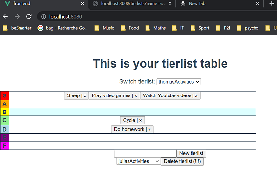

# frontend

## Project setup
```
yarn install
```

### Compiles and hot-reloads for development
```
yarn serve
```

### Compiles and minifies for production
```
yarn build
```

### Lints and fixes files
```
yarn lint
```

### Customize configuration
See [Configuration Reference](https://cli.vuejs.org/config/).


# backend
I realize there is no need for a handmade backend, the one provided by json-server suffices! The data are stored into db.json.

## Launching the backend
json-server watch -- db.json


# Using the application


The web application is located at http://localhost:8080/. It is a tierlist keeper that allows 
* selecting a tierlist among those existing in the database
* visualizing its content
* adding elements in a tier. To do so, double click on the cell of the targeted tier.
* deleting elements. To do so, click on the cross (x) located after the element
* adding tierlists
* deleting tierlists


# TODOs
* Allow pictures instead of only texts
* Better delete button
* Focus on appearing input field
* Allow drag and drop (How???)
* Handle statuses other than the right ones.